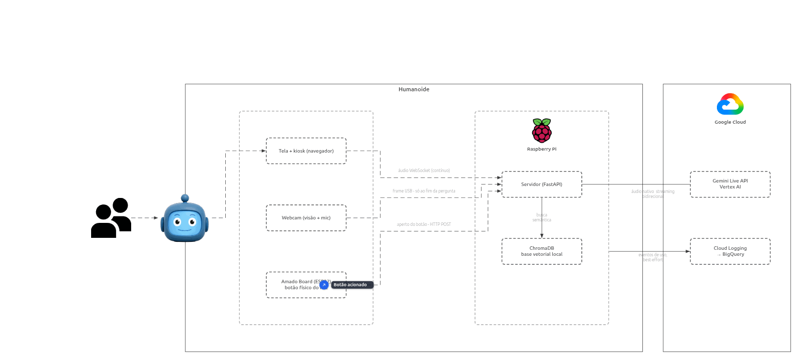
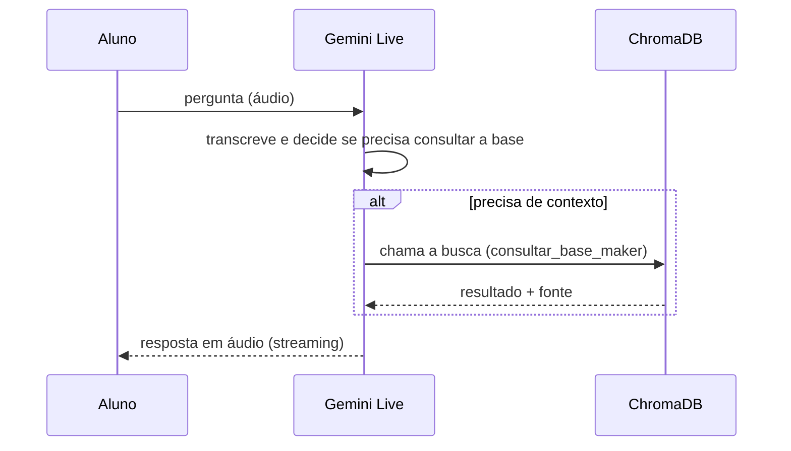

# Arquitetura técnica do JOSÉ (Jovem Orientador de Soluções Educacionais)

**Agente de voz para sala de aula**

José é um agente conversacional com presença física em sala: um rosto numa tela, uma voz, uma
câmera e um botão físico de microfone, apoiando professores/alunos dentro da sala maker. Este documento descreve como a arquitetura está estruturada hoje: IA, base de
conhecimento, comunicação entre as peças, stack e hardware.

`gemini-live-2.5-flash-native-audio` · `Google ADK` · `ChromaDB` · `Raspberry Pi 5` · `ESP32 / Amado Board`

---

## Visão geral - quem fala com quem

Três domínios físicos e lógicos distintos: os componentes de interação, o Raspberry Pi que roda dentro do humanoide (José),
e o Google Cloud, trocando um número pequeno de mensagens bem definidas entre si.

---

## Módulo — IA conversacional

O núcleo é a Gemini Live API rodando em modo de áudio nativo — não um pipeline clássico de
reconhecimento de fala → LLM → síntese de voz encadeados, mas um único modelo que ouve e fala em
streaming bidirecional contínuo.

**`gemini-live-2.5-flash-native-audio`**
Modelo de áudio nativo via Vertex AI. Recebe PCM 16kHz em streaming e já responde em áudio — turno
de fala e detecção de atividade (VAD) resolvidos pelo próprio modelo, não por um componente
separado no nosso código.

**Google ADK (Agent Development Kit)**
Orquestra a sessão: fila de entrada de áudio/eventos (`LiveRequestQueue`), loop de execução
(`Runner`) e o ciclo de function-calling — é o ADK que decide, turno a turno, se o modelo pediu
para chamar uma ferramenta.

**Visão computacional**
Frame mais recente da webcam é injetado no contexto sempre que o aluno termina de falar — não é
vídeo contínuo. José "vê" o que está na bancada só no instante em que alguém pergunta sobre algo
físico, mantendo custo e latência baixos.

**Sensibilidade de interrupção**
Modo configurável de detecção de atividade — de "sem interrupção" a sensibilidade reduzida —
pensado para salas cheias, onde voz de fundo não deveria cortar a resposta do agente no meio.

---

## Módulo — RAG (base de conhecimento)

O modelo não sabe o conteúdo didático de cor: ele pede para buscar, e a busca acontece localmente,
no próprio Pi — sem round-trip extra para a nuvem só para recuperar contexto.

A busca é uma decisão do modelo por turno, não uma etapa fixa do pipeline — perguntas de bom-dia
não disparam `consultar_base_maker`.

> **`kb_gap`** — Toda busca sem resultado bom vira um evento de observabilidade com a distância do
> vizinho mais próximo e se houve reranking — dá para distinguir "o conteúdo não existe na base"
> de "a busca descartou algo que estava perto".

---

## Módulo — Comunicação

Dois canais independentes — um para áudio contínuo, outro para o botão físico — mais uma camada de
resiliência de rede que assume, por padrão, que o Wi-Fi da escola vai cair.

**WebSocket — áudio**
Aberto uma única vez, no primeiro toque no mic, e mantido pelo resto da aula. Ligar/desligar o
microfone não fecha essa conexão — só liga/desliga se o áudio capturado é encaminhado.

**Web Audio API / AudioWorklet**
O navegador faz o downsampling do áudio do microfone para PCM 16kHz no próprio cliente, em lotes
de 200ms — sem plugin nativo nem dependência externa.

**HTTP + SSE — botão físico**
O Amado Board chama um endpoint HTTP simples a cada aperto; o servidor repassa isso ao navegador
via Server-Sent Events, que simula o mesmo clique do botão da tela.

**Resiliência de rede**
O Pi se auto-atribui um IP fixo dentro da sub-rede aprendida via DHCP — sem depender de reserva no
roteador da escola — e detecta queda de conectividade sozinho, abrindo a tela de configuração
automaticamente.

---

## Módulo — Stack tecnológico

Peças escolhidas para rodar inteiras dentro de um único Raspberry Pi, com o mínimo de dependência
de serviços externos além do modelo em si.

| | |
|---|---|
| **Backend** | Python 3.12 · `FastAPI` + `Uvicorn` · Google ADK |
| **Frontend** | JavaScript puro (sem framework) · Web Audio API / AudioWorklet · Server-Sent Events |
| **Dados** | ChromaDB (base vetorial, local) · BigQuery (dados analíticos de uso) |
| **Infraestrutura** | Docker Compose · NetworkManager (D-Bus) · systemd (timers de atualização) |
| **Nuvem** | Google Cloud — Vertex AI (Gemini Live) · Cloud Logging · BigQuery · Artifact Registry |
| **CI/CD** | GitHub Actions — build multi-arquitetura → publica imagem → cada Pi puxa e reinicia sozinho, sem intervenção manual |

---

## Módulo — Hardware

O corpo do José — especificações completas nos links de cada peça; aqui, o papel que cada uma
cumpre no sistema.

### Processamento — Raspberry Pi 5, 8GB
- Broadcom BCM2712, quad-core Cortex-A76 @ 2.4GHz
- 8GB LPDDR4X · GPU VideoCore VII
- Wi-Fi 802.11ac + Bluetooth 5.0 · Gigabit Ethernet
- PCIe 2.0 x1 — usado pelo SSD NVMe abaixo

### Armazenamento — SSD NVMe 256GB + HAT PCIe
- PCIe 3.0 x4 · formato M.2 2280
- HAT adaptador compatível com M.2 2280/2242/2230
- Substitui o cartão SD — banco vetorial e sistema num storage mais rápido e durável

### Rosto — Tela touch 10,1" IPS
- 1024×600 · capacitiva · alto-falantes integrados
- Expressões do José (olhos, boca, estados) e tela de configuração

### Visão + captação — Webcam Logitech C920s
- Full HD 1080p, autofoco
- Microfone integrado — entrada de áudio do José
- Conectada direto ao Pi via USB (V4L2), fora do navegador

### Interação física — Amado Board (ESP32)
- Wi-Fi + Bluetooth · compatível com Arduino IDE
- Driver de motores DC, headers para servo/OLED/ultrassom, SPI, dois I2C, sensor de temperatura, LDR — integrados
- No José hoje: só o botão físico de liga/desliga do microfone é usado

  É a mesma placa que já acompanha o material didático enviado às escolas — usá-la aqui também é
  dar um segundo propósito a um hardware que o aluno já tem em mãos, com espaço claro para
  crescer (motores, sensores) conforme o José ganhar mais interações físicas.

### Alimentação — Fonte oficial Raspberry Pi 5
- USB-C · 5V / 5A (27W) — dentro do que o Pi 5 exige sob carga com SSD e periféricos USB

---

## Módulo — Observabilidade

Cada José em campo manda eventos de uso real — não sintéticos, não de teste — para um pipeline que
vira dado analítico. O objetivo é evoluir o produto a partir do que acontece de verdade numa sala
cheia, não só do que funciona em teste controlado.

`session_started` / `session_ended` · `kb_gap` · `interrupted` · `network_down` / `network_recovered` · `component_error`

**Cloud Logging → BigQuery → dashboards.** Cada evento carrega dado bruto, não um rótulo
já pré-julgado — a mesma ocorrência de `kb_gap`, por exemplo, pode ser lida pelo lado pedagógico
("faltou conteúdo sobre X") ou técnico ("o limiar de busca descartou algo que estava perto") a
partir dos mesmos campos, sem precisar reemitir o evento de outro jeito.

---

## Fechamento — Perguntas abertas

Pontos onde uma segunda opinião técnica vale mais do que mais tempo decidindo sozinhos.

- Áudio nativo em streaming (um único modelo ouvindo e falando) troca controle fino sobre cada
  etapa por latência menor e menos peças no meio. Para uma sala de aula real, esse é o trade-off
  certo, ou um pipeline clássico (STT → LLM → TTS) daria mais previsibilidade onde importa?

- A estratégia de RAG hoje é busca vetorial simples com reranking, sobre um volume de conteúdo
  ainda pequeno por turma. Em que ponto isso deixa de escalar bem, e o que observaríamos primeiro
  como sintoma?

- Um único Raspberry Pi 5 roda IA conversacional, RAG, visão e rede ao mesmo tempo. Existe um teto
  real de carga (mais alunos falando ao mesmo tempo, mais salas) que vale antecipar antes de
  esbarrar nele em campo?

- Toda a base de conhecimento e o histórico de conversa vivem em memória/local no dispositivo, por
  sessão. Isso é adequado para o caso de uso, ou existe um ganho real em persistir e correlacionar
  entre aulas/turmas que ainda não estamos capturando?

---

*Amado Maker — José · documento vivo, última atualização por este time*
